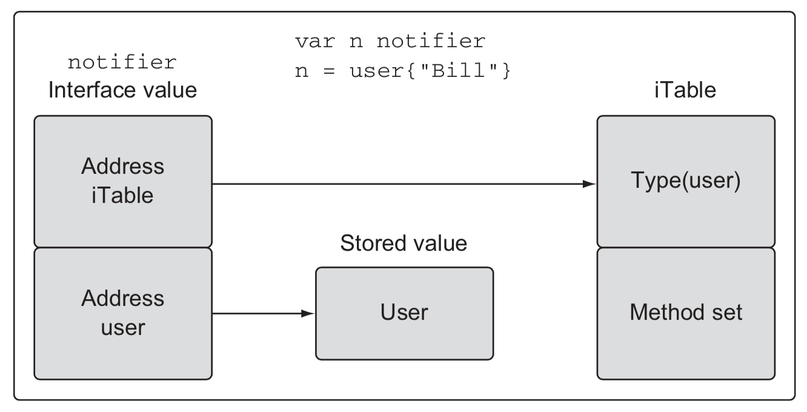
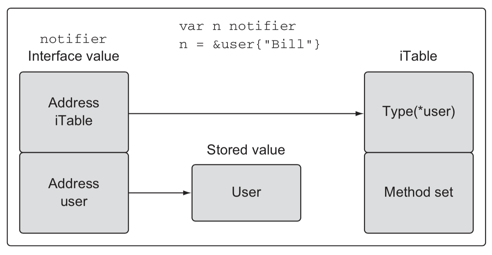
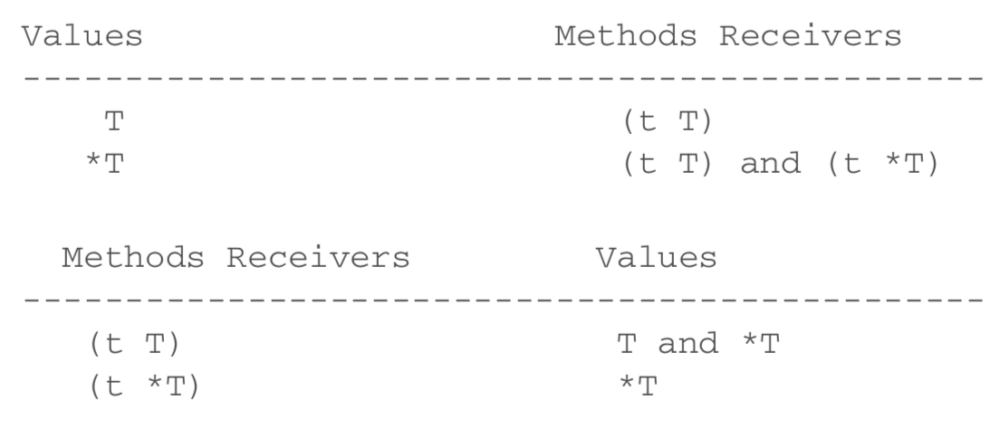

# Chapter 5. Go's Type System

## Custom Type

### Declaration
- 내장 타입을 기반으로 원하는 타입을 정의할 수 있다.
- 대표적인 예로 다양한 타입을 합성(composition)하는 struct가 있다.
  ```go
  type user struct {
    name string
    age int
  }
  ```
- Primitive 타입도 사용자 정의 타입으로 선언할 수 있다. 이 때 타입 변환은 암묵적으로 이뤄지지 않는다.
  ```go
  type Duration int64

  func main() {
    var d Duration

    d = int64(10) // cannot use int64(10) (type int64) as type Duration in assignment
  }
  ```

### Method
- 사용자 정의 타입에 한해 행위(behavior)를 정의할 수 있다.
- 메서드는 수신자(receiver)가 정의된 함수를 말한다. 메서드를 통해 타입의 상태와 행위 간의 응집도를 높일 수 있다.
  ```go
  type user struct {
    name string
  }

  func (u user) introduce() {
    fmt.Printf("My name is %s\n", u.name)
  }
  ```
- 수신자는 value receiver와 pointer receiver로 구분된다. 
  - Value receiver는 해당 타입의 값이 복사되기 때문에 조회 용도로 사용된다. 또는 편집된 복사본을 반환하는 immutable 함수 구현으로 사용할 수 있다.
  - Pointer receiver 해당 타입의 주소에 접근하기 때문에 값을 변경하는 용도로 사용된다.
  - 메서드를 정의할 때 위의 용도에 적합한 방식의 receiver를 사용한다.
  ```go
  type user struct {
    name string
  }

  // Value receiver
  func (u user) introduce() {
    fmt.Printf("My name is %s\n", u.name)
  }

  // Pointer receiver
  func (u *user) changeName(newName string) {
    u.name = newName
    fmt.Printf("My name changed to %s\n", u.name)
  }
  ```
  - 근데 '5.3 타입의 본질' section 후반부에서는 `메서드가 수신된 값을 변경하는지는 전혀 관련이 없다. 값의 본질에 따라 결정해야 한다.` 라고 한다. 
  - 그럼 '값의 본질'이란 뭘 뜻하는가? 책에서는 [time](https://golang.org/pkg/time/), [os](https://golang.org/pkg/os/) 표준 라이브러리의 일부분을 예를 들어 비교하고 있다.
  - 5.3.3 섹션 마지막(p.125) 문단은 정말 이해가 안된다...
  - 값이 복사되는 것을 방지하는 방법
    - [os.File](https://golang.org/src/os/types.go?s=369:411#L6) 타입이 그 예시
      - ~~런타임에 파일의 descriptor가 변경되면 의도치 않은 파일이 닫히거나 변경될 수 있다.~~ 
      - 간접적으로 파일에 접근함으로써 os 패키지의 클라이언트가 데이터를 덮어쓰지 못하도록 하여 소멸자가 엉뚱한 파일을 닫지 않도록 방지한다.
    - https://play.golang.org/p/f6anDAp10uy


## Interface
메서드의 모음이자 타입의 일종

### `interface{}`: The empty interface

- 구현된 메서드가 없다. 따라서 모든 타입을 만족한다.
```go
func DoSomething(v interface{}) { ... }
```
- TypeScript의 `any` 와는 다르다. 어떤 타입이 넘어와도 Runtime에 `interface{}`로 타입을 변환한다.

### Implementation




두 개의 word(2바이트로 구성된 데이터)로 구성된다.
1. 메서드 테이블(iTable)을 가리키는 word
2. 실 데이터를 가리키는 word

### Method Set

- Value Type에서 Pointer receiver를 호출하지 못하는 이유
  - 값의 주소를 알아낼 수 없는 경우가 있기 때문: https://play.golang.org/p/JOiqDZKncsT



### 표준 라이브러리로 살펴보는 인터페이스 사용법

1. io
2. fmt
3. sort


## References
- [Go in Action PDF](https://github.com/KeKe-Li/book/blob/master/Go/go-in-action.pdf)
- [Articles about Interface](https://github.com/golang/go/wiki/Articles#interfaces--oop)
- [Sorting Inventory Items in Go](https://adampresley.github.io/2015/09/06/sorting-inventory-items-in-go.html)